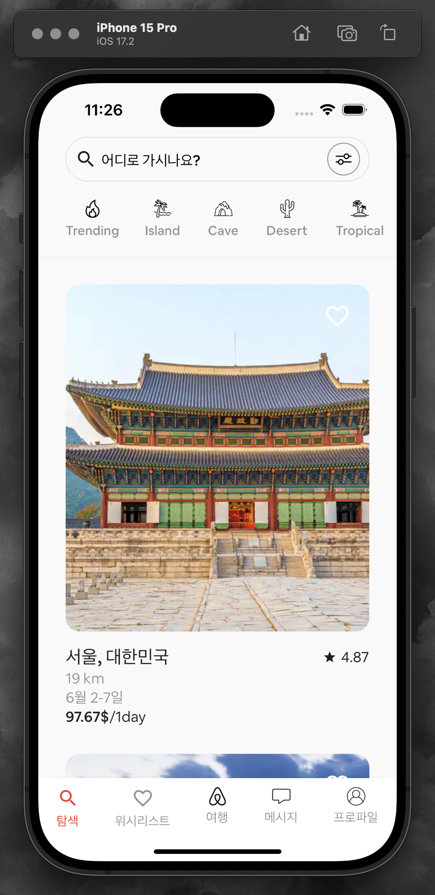

# Mock_Airbnb app

## 프로젝트 소개

이 프로젝트는 에어비앤비의 핵심 기능을 재현하면서 UI/UX 디자인과 기능성에 중점을 두고 있습니다.

## 주요 기능

- **검색**: 맞춤 검색 기능을 통해 다양한 장소를 탐색하고 찾아볼 수 있습니다.

- **상세 보기**: 장소의 상세 정보, 아름다운 이미지, 가격, 평점 등을 확인할 수 있습니다.

- **즐겨찾기**: 사용자는 나중에 빠르게 접근할 수 있도록 자신이 좋아하는 목적지를 북마크할 수 있습니다.

## 기술적 측면

- **Flutter 프레임워크**: iOS와 안드로이드에서 일관된 경험을 보장하기 위해 Flutter를 사용하여 크로스플랫폼 앱 개발을 진행했습니다.

- **디자인**: 에어비앤비 실제 앱의 모양과 느낌에 맞춰 세심하게 디자인된 UI 컴포넌트입니다.

- **기능**: 실제 사용을 시뮬레이션하기 위해 완전히 기능하는 인터페이스와 더미 데이터를 포함하고 있습니다.

## 도전 과제

에어비앤비가 수년에 걸쳐 완성한 복잡한 UI 패턴과 사용자 상호작용 흐름을 정확하게 모방하는 것이 주된 도전 과제였습니다.

## 학습 성과

이 프로젝트를 통해 잘 구조화된 프로젝트의 중요성, 그리고 고급 UI 컴포넌트 통합에 대해 배웠습니다.

## 면책 조항

이 앱은 교육 목적으로만 만들어진 개인 프로젝트이며 상업적 사용을 위한 것이 아닙니다. 내용, 이미지 및 데이터는 공식 에어비앤비 애플리케이션이나 회사와는 관련이 없습니다.

